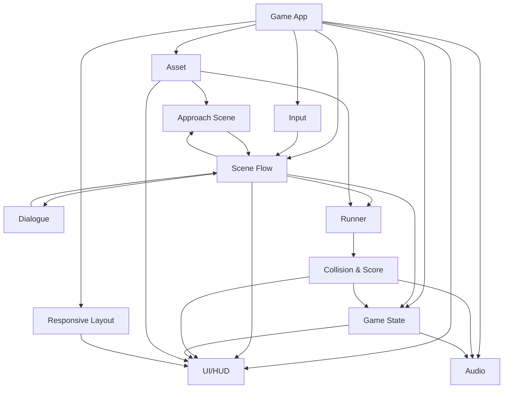
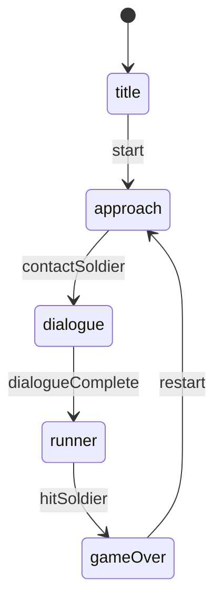
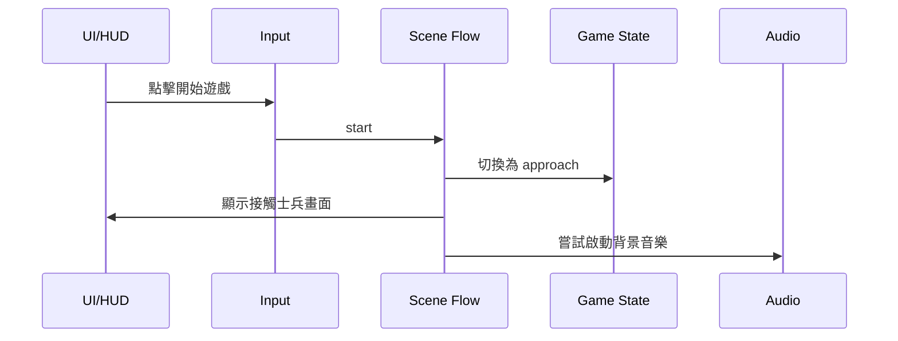
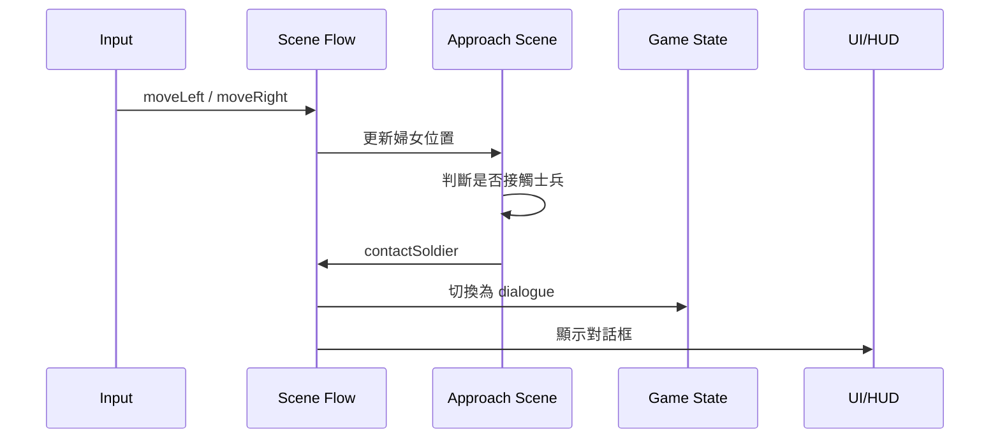
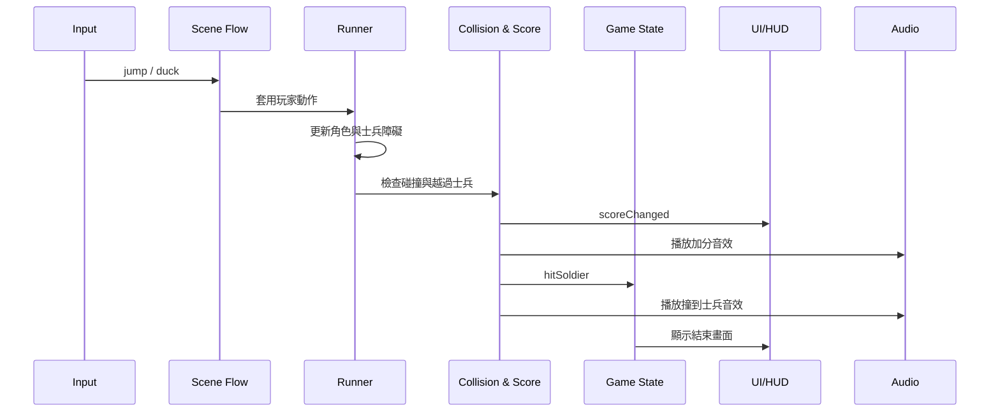

# 逃離羅馬守衛：空墓之謎 概要設計文件

## 1. 文件目的

本文根據 `doc/proposal.md` 撰寫，用於描述「逃離羅馬守衛：空墓之謎」的概要設計。

本文重點是：

- 劃分遊戲主要模組。
- 說明模組職責。
- 說明模組與模組之間的關係。
- 說明主要狀態流程、資料流與事件流。

本文不描述詳細程式碼實作，不加入需求文件未要求的新功能。

## 2. 系統目標與設計範圍

本遊戲是一個純 `HTML/CSS/JS` 網頁遊戲，主要支援 iPad 橫向瀏覽器。

遊戲主要流程為：

1. 首頁。
2. 左右移動婦女接觸羅馬士兵。
3. 顯示短對話。
4. 進入橫向跑酷。
5. 撞到士兵後結束，顯示本局分數與教學總結。

設計範圍包含：

- 遊戲初始化。
- 遊戲狀態管理。
- iPad 觸控輸入與桌面鍵盤輸入。
- 場景流程控制。
- 接觸士兵階段。
- 對話流程。
- 跑酷邏輯。
- 士兵障礙生成。
- 碰撞與計分。
- UI/HUD 顯示。
- 音效與背景音樂控制。
- 資產管理。
- iPad 橫向畫面適配。

設計範圍不包含：

- 登入。
- 後端服務。
- 雲端排行榜。
- 最高分保存。
- 經文提示或章節引用。
- 手機直向完整玩法。

## 3. 整體架構

本遊戲採用「狀態驅動」的前端架構。

核心原則：

- Game State 作為流程狀態的唯一來源。
- Input 模組只輸出抽象玩家動作，不直接修改場景。
- Scene Flow 模組根據 Game State 決定目前啟用的場景。
- Runner、Approach Scene、Dialogue 只處理各自階段的邏輯。
- UI/HUD 根據狀態與分數更新畫面。
- Audio 模組統一處理背景音樂與音效，不分散在各模組中。

整體模組關係如下：



## 4. 模組設計

### 4.1 Game App 模組

職責：

- 初始化遊戲。
- 建立主要模組。
- 載入必要資產。
- 啟動遊戲主循環。
- 協調全域生命週期。

不負責：

- 不直接判斷碰撞。
- 不直接更新分數。
- 不直接處理具體 UI 按鈕邏輯。

與其他模組關係：

- 建立並持有 Game State、Input、Scene Flow、UI/HUD、Audio、Asset、Responsive Layout。
- 將主循環時間差傳給 Scene Flow 或目前啟用的場景模組。

### 4.2 Game State 模組

職責：

- 管理目前遊戲狀態。
- 管理本局分數。
- 管理聲音開關狀態。
- 提供狀態切換方法。

主要狀態：

- `title`：首頁。
- `approach`：婦女左右移動接觸士兵。
- `dialogue`：顯示短對話。
- `runner`：橫向跑酷。
- `gameOver`：撞到士兵後的結束畫面。

與其他模組關係：

- Scene Flow 根據 Game State 決定目前場景。
- UI/HUD 根據 Game State 顯示對應畫面。
- Collision & Score 在撞到士兵後要求 Game State 切換到 `gameOver`。
- Audio 根據 Game State 與聲音開關狀態播放或停止聲音。

### 4.3 Input 模組

職責：

- 統一處理 iPad 觸控按鈕與桌面鍵盤輸入。
- 將實際輸入轉換為抽象動作。
- 避免場景模組直接綁定 DOM 事件。

對外輸出的動作：

- `moveLeft`
- `moveRight`
- `jump`
- `duck`
- `start`
- `restart`
- `toggleSound`

與其他模組關係：

- 接收 UI/HUD 按鈕事件或鍵盤事件。
- 將抽象動作交給 Scene Flow。
- Scene Flow 根據目前狀態決定該動作是否有效。

### 4.4 Scene Flow 模組

職責：

- 管理首頁、接觸士兵、對話、跑酷、結束畫面的流程。
- 根據 Game State 啟用對應場景。
- 接收 Input 模組送出的抽象動作。
- 協調場景之間的切換。

主要流程：



與其他模組關係：

- 從 Input 接收玩家動作。
- 呼叫 Approach Scene、Dialogue、Runner 的更新方法。
- 要求 Game State 切換狀態。
- 通知 UI/HUD 更新目前畫面。

### 4.5 Approach Scene 模組

職責：

- 管理接觸士兵階段。
- 控制婦女角色左右移動。
- 判斷婦女是否接觸羅馬士兵。

主要資料：

- 婦女角色位置。
- 羅馬士兵位置。
- 接觸判定範圍。

事件輸出：

- `contactSoldier`：婦女接觸士兵後送出，由 Scene Flow 切換至 `dialogue`。

與其他模組關係：

- 從 Scene Flow 接收 `moveLeft`、`moveRight` 動作。
- 使用 Asset 模組提供的角色與背景資產。
- 接觸士兵後通知 Scene Flow。

### 4.6 Dialogue 模組

職責：

- 顯示 2-3 句短對話。
- 控制對話完成時機。
- 對話結束後通知 Scene Flow 進入跑酷。

對話內容：

1. 羅馬士兵：「站住！墓前有重兵看守，不准靠近。」
2. 婦女：「我只是來看墓，根本不可能偷走屍體。」
3. 系統提示：「守衛逼近了，開始逃離挑戰！」

事件輸出：

- `dialogueComplete`：對話結束後送出，由 Scene Flow 切換至 `runner`。

與其他模組關係：

- UI/HUD 負責顯示對話框。
- Dialogue 模組提供目前對話文字與完成狀態。
- Scene Flow 根據完成事件切換狀態。

### 4.7 Runner 模組

職責：

- 管理橫向跑酷階段。
- 控制婦女跳躍與蹲下。
- 生成士兵障礙。
- 管理速度提升。
- 更新跑酷場景。

主要資料：

- 婦女角色跑酷狀態：地面、跳躍、蹲下。
- 士兵障礙列表。
- 遊戲速度。
- 已經過時間。
- 下一次士兵生成時間。

士兵障礙類型：

- 低位士兵：需跳躍避開。
- 高舉長矛士兵：需蹲下避開。

難度規則：

- 每 15 秒階段性加速。
- 加速會影響士兵移動速度或生成節奏。
- 前 15 秒需保留學習空間，不應過難。

與其他模組關係：

- 從 Scene Flow 接收 `jump`、`duck` 動作。
- 使用 Asset 模組提供的婦女、士兵、背景資產。
- 每次更新時呼叫 Collision & Score 判斷碰撞與加分。
- 撞到士兵後由 Collision & Score 通知 Game State 進入 `gameOver`。

### 4.8 Collision & Score 模組

職責：

- 判斷婦女是否撞到士兵。
- 判斷婦女是否成功越過士兵。
- 每越過一名士兵加 10 分。
- 撞到士兵後觸發遊戲結束。

主要規則：

- 低位士兵若沒有被跳過，視為碰撞。
- 高舉長矛士兵若沒有被蹲下避開，視為碰撞。
- 每名士兵只能計分一次。
- 不保存最高分。
- 不顯示最高分。

事件輸出：

- `scoreChanged`：分數改變後通知 UI/HUD。
- `hitSoldier`：撞到士兵後通知 Game State 與 Audio。

與其他模組關係：

- 從 Runner 接收婦女與士兵障礙資料。
- 更新 Game State 中的本局分數。
- 通知 UI/HUD 更新分數。
- 通知 Audio 播放加分或撞擊音效。

### 4.9 UI/HUD 模組

職責：

- 管理所有 DOM 介面。
- 顯示首頁、對話、HUD、結束畫面。
- 顯示與接收操作按鈕事件。

主要 UI：

- 開始遊戲按鈕。
- 左右移動按鈕。
- 蹲下按鈕。
- 跳躍按鈕。
- 本局分數。
- 聲音開關。
- 結束畫面。
- 重新開始按鈕。

結束畫面只顯示：

- 本局分數。
- 教學總結：「墳墓外有守衛，很難成功偷走屍體。」
- 重新開始按鈕。

不顯示：

- 最高分。
- 排行榜。
- 登入入口。
- 經文提示或章節引用。

與其他模組關係：

- 向 Input 模組送出按鈕事件。
- 從 Game State 讀取目前狀態。
- 從 Collision & Score 或 Game State 取得分數。
- 從 Dialogue 模組取得對話文字。

### 4.10 Audio 模組

職責：

- 管理背景音樂。
- 管理跳躍、蹲下、加分、撞到士兵音效。
- 管理播放與靜音狀態。
- 處理 iPad 瀏覽器的互動後播放限制。

聲音行為：

- 背景音樂可在玩家點擊開始遊戲或開啟聲音後播放。
- 聲音開關控制背景音樂與音效。
- 玩家靜音時，不播放背景音樂與音效。

與其他模組關係：

- 從 Input 或 UI/HUD 接收 `toggleSound` 動作。
- 從 Runner 接收跳躍、蹲下音效觸發。
- 從 Collision & Score 接收加分、撞到士兵音效觸發。
- 根據 Game State 決定是否播放背景音樂。

### 4.11 Asset 模組

職責：

- 管理圖片、角色、背景、士兵、音效、背景音樂等資產。
- 提供穩定的資產鍵名給其他模組使用。
- 避免其他模組直接依賴實際檔案路徑。

資產類型：

- 角色：婦女。
- 障礙：低位士兵、高舉長矛士兵。
- 場景：墓口、石壁、跑酷背景。
- UI：按鈕、面板、聲音圖示。
- Audio：背景音樂、跳躍、蹲下、加分、撞擊音效。

限制：

- 使用者提供的 4 張圖片只作為風格參考，不作正式素材依賴。

與其他模組關係：

- Game App 初始化時載入或登記資產。
- Approach Scene、Runner、UI/HUD、Audio 透過 Asset 模組取得資產。

### 4.12 Responsive Layout 模組

職責：

- 管理 iPad 橫向優先的畫面適配。
- 確保角色、士兵、HUD、操作按鈕在橫向畫面中清楚可用。
- 直向開啟時可顯示旋轉提示。

設計要求：

- 操作按鈕尺寸需適合手指觸控。
- 跳躍與蹲下按鈕需分開，降低誤觸。
- HUD 不遮擋跑酷判斷區。
- 不實作完整手機直向玩法。

與其他模組關係：

- UI/HUD 根據 Responsive Layout 的結果調整按鈕與面板位置。
- Runner 可根據畫面尺寸調整地面線、角色位置與障礙生成位置。

## 5. 模組間事件流

### 5.1 開始遊戲事件流



### 5.2 接觸士兵事件流



### 5.3 跑酷與碰撞事件流



## 6. 主要資料流

### 6.1 輸入資料流

玩家操作由 UI/HUD 或鍵盤事件進入 Input 模組。

Input 模組只輸出抽象動作，不直接修改遊戲資料。

```text
玩家觸控 / 鍵盤
→ Input
→ 抽象動作
→ Scene Flow
→ 當前場景模組
```

### 6.2 分數資料流

分數由 Collision & Score 模組根據越過士兵事件更新。

```text
Runner 障礙資料
→ Collision & Score
→ Game State 本局分數
→ UI/HUD 分數顯示
```

### 6.3 聲音資料流

聲音事件由玩家操作、跑酷行為或碰撞結果觸發。

```text
Input / Runner / Collision & Score
→ Audio
→ 背景音樂或音效播放
```

## 7. 狀態切換規則

| 目前狀態 | 觸發事件 | 下一狀態 | 說明 |
| --- | --- | --- | --- |
| `title` | `start` | `approach` | 玩家點擊開始遊戲 |
| `approach` | `contactSoldier` | `dialogue` | 婦女接觸羅馬士兵 |
| `dialogue` | `dialogueComplete` | `runner` | 短對話完成 |
| `runner` | `hitSoldier` | `gameOver` | 撞到士兵 |
| `gameOver` | `restart` | `approach` | 玩家重新開始 |

## 8. 設計限制與原則

- 使用純 `HTML/CSS/JS`。
- 不加入後端服務。
- 不加入登入。
- 不加入雲端排行榜。
- 不保存最高分。
- 不顯示最高分。
- 不加入經文提示或章節引用。
- 不依賴使用者提供的參考圖作為正式素材。
- 以 iPad 橫向為主要設計目標。
- 遊戲規則只使用羅馬士兵作為障礙。
- 結束畫面只顯示本局分數、教學總結與重新開始按鈕。

## 9. 驗收檢查

概要設計需滿足以下檢查項：

- 文件位於 `roman-guard-escape/doc/high-level-design.md`。
- 文件內容以 `doc/proposal.md` 為唯一需求來源。
- 文件包含清楚的模組劃分。
- 文件包含模組之間的關係。
- 文件包含主要狀態流程：首頁 → 接觸士兵 → 對話 → 跑酷 → 結束。
- 文件描述輸入、跑酷、碰撞、計分、UI、音效之間的資料與事件關係。
- 文件不加入最高分保存、登入、後端、雲端排行榜、經文引用等未要求功能。
- 文件使用繁體中文。
